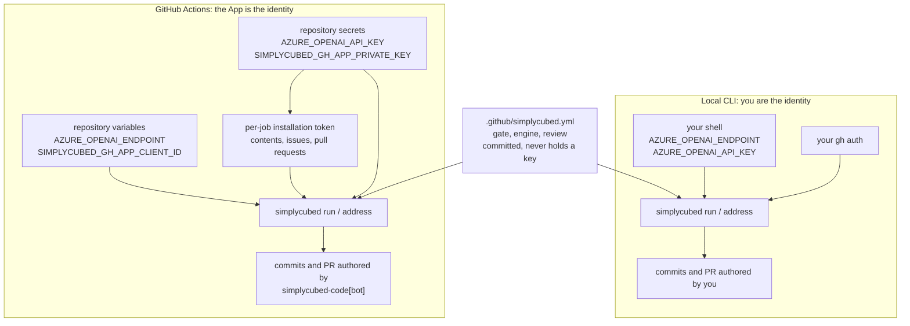

# Setup

This guide shows how to install SimplyCubed Code in a repository you control so
it can turn issues into pull requests inside your own GitHub environment.

You will:

- install the `simplycubed` CLI
- generate the repository config and GitHub workflow files
- connect your GitHub App and model credentials
- run a one-time self-test
- hand the first issue to the agent

## Before you begin

You need:

- Go installed locally so you can run `go install`
- `gh` authenticated against the repository you want to onboard
- write access on that repository
- an Azure OpenAI endpoint and API key

## Install and configure

1. Install the CLI:

```sh
go install github.com/simplycubed/code/cmd/simplycubed@v0.1.9
simplycubed version
```

2. In the target repository, generate the setup files and labels:

```sh
simplycubed init --workflow
```

That creates the `sc:*` labels through your local `gh` session and writes three
files into your repository:

- `.github/simplycubed.yml`, the repository config
- `.github/workflows/simplycubed.yml`, the workflow that runs SimplyCubed Code
- `.github/workflows/simplycubed-selftest.yml`, a one-time installation check

These are local file changes in your repository. Nothing is merged or installed
remotely for you.

3. Edit `.github/simplycubed.yml` and set a real gate that is already green on
your default branch. A minimal customer setup looks like this:

```yaml
labelPrefix: sc
gate: make check
```

### Optional: prove it locally first

Before wiring GitHub Actions, you can prove the loop works from your terminal
with the same config file:

```sh
export AZURE_OPENAI_ENDPOINT="https://<resource>.openai.azure.com"
export AZURE_OPENAI_API_KEY="<key>"
simplycubed run owner/repo#N --repo-dir .
```

4. Create and install the GitHub App identity, then add the required repository
settings.

Create the `simplycubed-code` GitHub App with `Contents`, `Issues`, and `Pull
requests` permissions only, disable the webhook, set install visibility to `Any
account`, and install it on the repository.

Then add these repository settings:

- Variable: `SIMPLYCUBED_GH_APP_CLIENT_ID`, the App Client ID, the `Iv23` string on the App settings page
- Secret: `SIMPLYCUBED_GH_APP_PRIVATE_KEY`
- Variable: `AZURE_OPENAI_ENDPOINT`
- Secret: `AZURE_OPENAI_API_KEY`

The Actions runtime authenticates as the `simplycubed-code` GitHub App, so the
App ID and private key are required. Store the private key as the full PEM
contents, including the `-----BEGIN` and `-----END` lines.

Each job mints its own installation token for that repository, so the agent
authors commits, pull requests, and comments as `simplycubed-code[bot]`, and
its pull requests receive their own CI runs. A personal access token is not an
alternative: the reusable workflow accepts App credentials only.

5. Commit the generated config and workflow files in the target repository, open
a setup pull request, and merge it yourself. Setup files are written locally by
`simplycubed init` and merged by a human, because the runtime holds no
`workflows` permission and cannot add its own workflow files.

6. Run the installation self-test before you rely on the workflow:

```sh
gh workflow run simplycubed-selftest
```

That runs in your own environment and reports whether the App token resolves to
a bot, whether it is correctly denied Actions administration, whether a commit
is possible, and whether the engine can start there. Delete the self-test
workflow once it passes; normal operation goes through the App and the `sc:go`
label.

7. File an issue that describes a small change and apply the `sc:go` label.

8. Wait for the workflow to open a pull request. Review it like any other PR:

- merge it yourself if it is good
- or request changes; the fixer loop will address feedback on the current head
  and push back to the same branch

That is the first end-to-end customer path: issue -> PR -> human merge.

## Day-to-day use

Once setup is complete, your team uses SimplyCubed Code through normal GitHub
workflows:

- apply `sc:go` to an issue to start implementation
- review the pull request the agent opens
- request changes if needed; the fixer loop pushes updates back to the same PR
- merge it yourself when it meets your standards

## Where each value goes

The same two Azure values are needed in both places, and setting one does not
set the other. A repository secret is not visible to your local shell, and a
reusable workflow inherits nothing from SimplyCubed.



## Azure values

The shipped Codex-on-Azure setup needs these values:

| Name | Where it is used | Secret? |
| --- | --- | --- |
| `AZURE_OPENAI_ENDPOINT` | Base Azure OpenAI endpoint, for example `https://<resource>.openai.azure.com` | No |
| `AZURE_OPENAI_API_KEY` | Azure OpenAI API key | Yes |
| model or deployment name | Optional override passed as `--model` locally or `model:` in the caller workflow | No |

If you do not set a model override, the CLI and reusable workflow default to
`gpt-5.4`.

## Where the key lives

The API key lives in different places depending on where `simplycubed` runs.

- Local CLI run: export `AZURE_OPENAI_API_KEY` in the shell that runs
  `simplycubed`. Do not commit it, and do not expect a GitHub repository secret
  to appear in your local terminal.
- GitHub Actions run: store `AZURE_OPENAI_API_KEY` as a repository secret. The
  caller workflow passes it into the reusable workflow job as an environment
  variable.

In both cases the config references the key by environment variable name. The
key value does not belong in `.github/simplycubed.yml` or any committed file.

## Local CLI vs GitHub Actions

Use the same endpoint and key in both places, but wire them differently.

### Local CLI

For local runs such as `simplycubed run owner/repo#123`, the CLI reads:

- `AZURE_OPENAI_ENDPOINT` from your shell environment
- `AZURE_OPENAI_API_KEY` from your shell environment
- the repo gate and label prefix from `.github/simplycubed.yml`

Example:

```sh
export AZURE_OPENAI_ENDPOINT="https://<resource>.openai.azure.com"
export AZURE_OPENAI_API_KEY="<key>"
simplycubed run owner/repo#123 --repo-dir .
```

To use Claude Code locally instead, set `engine: claude` in
`.github/simplycubed.yml`. That local path uses your existing `claude` CLI
authentication and does not need Azure variables:

```yaml
gate: make check
engine: claude
```

```sh
simplycubed run owner/repo#123 --repo-dir .
```

### GitHub Actions

For the hosted-in-your-GitHub path, the caller workflow in your repository
passes:

- `vars.AZURE_OPENAI_ENDPOINT` to the reusable workflow input
  `azure-openai-endpoint`
- `secrets.AZURE_OPENAI_API_KEY` to the reusable workflow secret
  `azure-openai-api-key`
- `vars.SIMPLYCUBED_GH_APP_CLIENT_ID` to the reusable workflow input
  `github-app-client-id`
- `secrets.SIMPLYCUBED_GH_APP_PRIVATE_KEY` to the reusable workflow secret
  `github-app-private-key`

The reusable workflow installs the CLI, exports the endpoint and key for the
job, and runs `simplycubed run` or `simplycubed address`.

That hosted path is still Codex-on-Azure only. The reusable workflow installs
the Codex CLI, not the Claude CLI, and its inputs and secrets still require the
Azure endpoint and API key.

## Watching it run before it writes

Two commands answer "is this configured correctly" without changing anything.

`simplycubed preflight` validates the repository config and the engine settings
and exits. It is what the workflow runs before installing the rest of the
toolchain, so a misconfigured repository finds out in seconds.

`simplycubed run owner/repo#N --dry-run` runs the whole loop, including the
engine and your real gate, and skips the push and every GitHub write. It prints
what it would have done instead, and in Actions writes that to the run summary.

If something goes wrong, [troubleshooting.md](troubleshooting.md) starts from
the symptom.

## Optional model override

If your Azure deployment name is not `gpt-5.4`, set it explicitly.

- Local CLI: pass `--model <deployment-name>`.
- GitHub Actions: uncomment and set `model:` in
  `.github/workflows/simplycubed.yml`.

The current shipped workflow uses one model value per run. Per-role model
tiering is not wired yet.
