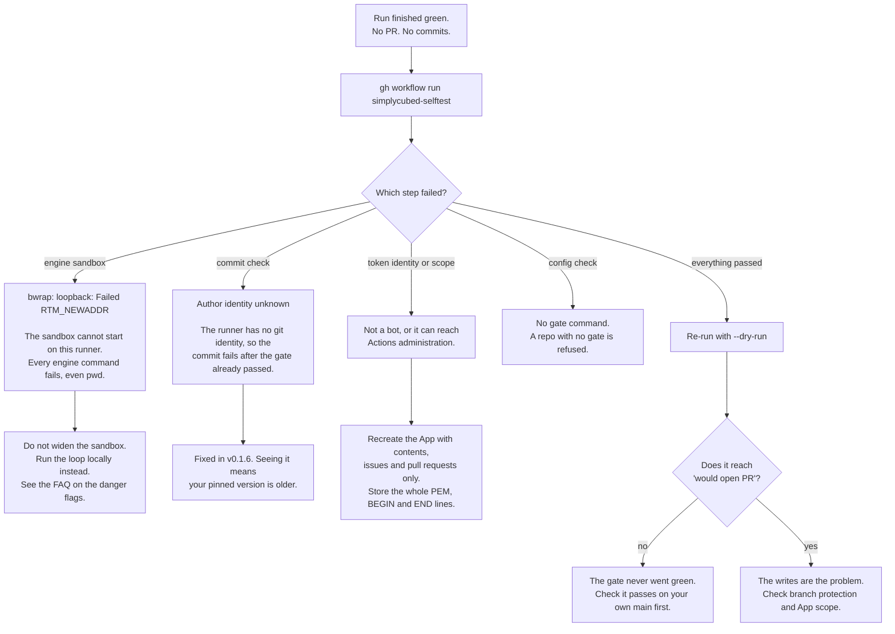

# Troubleshooting

Most first-run problems share one symptom: **the run finished green and nothing
happened.** No pull request, no commits, no comment. The job succeeded, so
nothing draws your attention to it.

The agent can fail in ways that leave its exit code at zero. If it cannot
execute a command it reads nothing, changes nothing, and finishes cleanly, and
the loop then reports, correctly, that there was nothing to propose.

Use this page to tell those cases apart.

## Start here



## The two tools

**The self-test** runs in your own runner and checks the things a local run
cannot tell you. `simplycubed init --workflow` writes it into your repository.

```sh
gh workflow run simplycubed-selftest
```

**A dry run** exercises the whole loop and skips only what would change your
repository. The worktree is created, the engine runs, and your gate grades the
result. The push and every GitHub write are skipped, and what would have
happened is printed instead.

```sh
simplycubed run owner/repo#12 --dry-run
```

## The engine sandbox cannot start

```
bwrap: loopback: Failed RTM_NEWADDR: Operation not permitted
```

The engine sandboxes the commands the model runs. On Linux that uses
bubblewrap, which needs to create a network namespace, and a stock GitHub
Actions runner does not permit it. Every command the engine tries then fails,
including `pwd`, so the agent reads nothing and changes nothing while still
exiting successfully.

**Do not widen the sandbox to get past this.** `SIMPLYCUBED_SANDBOX` exists for
adopters who have externally sandboxed their runners and are making that
decision knowingly. The model provider key is inside the runner, and an
ephemeral machine does not undo an exfiltrated secret. The
[FAQ](faq.md) explains the reasoning.

Instead, the run stops and a human finishes the work, the same rule that already
applies to workflow files the App cannot push.

## The commit fails after the gate passed

```
Author identity unknown ... unable to auto-detect email address
```

A runner has no git identity configured. This one is expensive because it lands
*after* the model has done its work and your gate has gone green: all of the
engine time is spent and none of the result is kept.

Fixed in v0.1.6, which sets the committer from the credential's own login. If
you see it, the version your caller workflow pins is older than that.

## The agent's pull requests get no CI

Pull requests opened with a `GITHUB_TOKEN` do not trigger other workflows. If
your required checks never appear on the agent's pull requests, the run is
authenticating with the default token rather than the App.

Check that `SIMPLYCUBED_GH_APP_CLIENT_ID` and `SIMPLYCUBED_GH_APP_PRIVATE_KEY`
are set.
The self-test's first step fails when they are missing or wrong.

## The run was refused before it started

```
app: actor is not authorized to run on this repository
```

The person who applied the label or submitted the review does not have write
access. Anyone can open an issue on a public repository, so triggering the agent
requires write or admin, and the runtime checks it twice: once in the caller
workflow before any secret is in scope, and again in the product.

## Nothing happened at all, and no workflow ran

Check what actually triggers a run:

- A `sc:go` label on an issue.
- A **submitted review** on a pull request. A plain comment in the conversation
  box is a different GitHub event and does not count. Use **Files changed →
  Review changes**.
- A comment beginning with `@` and your App's name, as set in `appName:`, followed by `go`, `address` or
  `help`. The mention has to start the comment, so quoting an earlier one never
  re-triggers anything, and an unrecognised verb does nothing.

## The gate never passes

This is the common case, and it is usually the repository rather than the agent.
The [FAQ](faq.md) covers it in detail: your gate has to be green on your own
default branch first, it should mirror what your CI actually enforces, and
genuinely environmental checks belong in CI rather than the gate.
